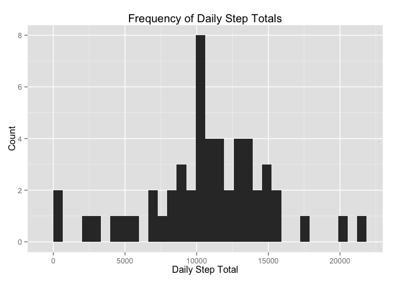
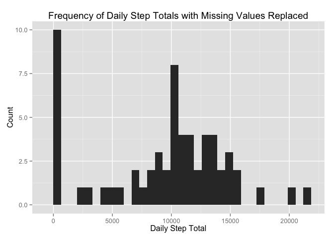
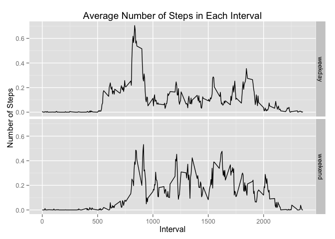

# Reproducible Research: Peer Assessment 1


## Loading and preprocessing the data

### Load Data

```r
unzip("activity.zip")
activity_raw <- read.csv("activity.csv")
```

### Process Data

The data was processed by removing incomplete cases, then coercing the date 
column into Date objects. 


```r
activity_proc <- activity_raw[complete.cases(activity_raw),]
activity_proc$date <- as.Date(activity_proc$date)
```

The daily step total was calculated by summing the steps measured on the same
date.

```r
daily_total_steps <- tapply(activity_proc$steps,activity_proc$date, sum)
```


## What is mean total number of steps taken per day?
### Histogram of Total Number of Steps Taken Each Day

The histogram shows the daily step total frequencies. The observations
are grouped into 32 bins, which provides a balance of granularity and summary.

```r
library(ggplot2)
max_steps_in_day <- max(daily_total_steps)
qplot(daily_total_steps, 
      geom = "histogram", 
      binwidth = max_steps_in_day/32,
      xlab = "Daily Step Total",
      ylab = "Count",
      main = "Frequency of Daily Step Totals")
```

 

### Report Mean and Median of Total Number of Steps Taken per Day

The mean total number of steps per day is 

```r
mean_daily_total_steps <- mean(daily_total_steps)
mean_daily_total_steps
```

```
## [1] 10766.19
```

The median total number of steps per day is 

```r
median_daily_total_steps <- median(daily_total_steps)
median_daily_total_steps
```

```
## [1] 10765
```

## What is the average daily activity pattern?

### Time series plot (i.e. type = "l") of the 5-minute interval (x-axis) and the average number of steps taken, averaged across all days (y-axis)

#### Process Data

This section will reuse the processed data created in the previous section.

The average number of steps in each interval is calculated by summing the number
of steps in each interval and dividing by the number of days. If a day does not
contain any valid values, then it is not be counted in the number of days used 
for the average. The first day in the data set, 2012-10-01, in not included for 
this reason.


```r
total_steps_in_interval <- tapply(activity_proc$steps,activity_proc$interval, sum)
num_of_days <- length(as.factor(activity_proc$date))

avg_steps_in_interval <- total_steps_in_interval/num_of_days

## Convert to a factor to extract all the unique values
interval_level <- attr(as.factor(activity_proc$interval),"levels")
## Convert to numeric so the plot is sorted correctly
interval_level <- as.numeric(interval_level)

interval_avg_steps <- data.frame(interval_level, avg_steps_in_interval)

qplot(interval_level, 
      avg_steps_in_interval, 
      interval_avg_steps,
      geom = "line",
      xlab = "Interval", 
      ylab = "Average Number of Steps",
      main = "Average Number of Steps in Each Interval")
```

 

### Which 5-minute interval, on average across all the days in the dataset, contains the maximum number of steps?


```r
index_max <- which.max(x = interval_avg_steps$avg_steps_in_interval)
interval_avg_steps$interval_level[index_max]
```

```
## [1] 835
```

## Imputing missing values
### Calculate and report the total number of missing values in the dataset (i.e. the total number of rows with NAs)
The number of missing values is the dataset is shown below.

```r
num_missing_values <- nrow(activity_raw[is.na(activity_raw),])
num_missing_values
```

```
## [1] 2304
```

### Devise a strategy for filling in all of the missing values in the dataset.

I used the strategy of replacing the missing values with the average value for 
that interval.

### Create a new dataset that is equal to the original dataset but with the missing data filled in.

```r
# Add a column with interval averages to the raw data
activity_raw_plus_avgs <- merge(x = activity_raw,
                                y = interval_avg_steps, 
                                by.x = "interval",
                                by.y = "interval_level")

# Put the rows back in the original order
index <- with(activity_raw_plus_avgs, order(date, interval))
activity_raw_plus_avgs <- activity_raw_plus_avgs[index,]


activity_raw_plus_avgs$steps <- ifelse(is.na(activity_raw_plus_avgs$steps),activity_raw_plus_avgs$avg_steps_in_interval,activity_raw_plus_avgs$steps)

activity_replace_na <- activity_raw_plus_avgs[,c(2,3,1)]
row.names(activity_replace_na) <- NULL
```

### Make a histogram of the total number of steps taken each day and Calculate and report the mean and median total number of steps taken per day.

This histogram shows the frequency of the new processed data. In the new data, the missing values are replaced with the average value for that interval.

```r
daily_total_steps_replace_na <- tapply(activity_replace_na$steps,activity_replace_na$date, sum)
library(ggplot2)
max_steps_in_day <- max(daily_total_steps_replace_na)
qplot(daily_total_steps_replace_na, 
      geom = "histogram", 
      binwidth = max_steps_in_day/32,
      xlab = "Daily Step Total",
      ylab = "Count",
      main = "Frequency of Daily Step Totals with Missing Values Replaced")
```

 

The mean total number of steps per day is 

```r
mean_daily_total_steps_replace_na <- mean(daily_total_steps_replace_na)
mean_daily_total_steps_replace_na
```

```
## [1] 9359.132
```

The median total number of steps per day is 

```r
median_daily_total_steps_replace_na <- median(daily_total_steps_replace_na)
median_daily_total_steps_replace_na
```

```
## [1] 10395
```

The original mean daily step total is 

```r
mean_daily_total_steps
```

```
## [1] 10766.19
```
The new mean daily step total is 

```r
mean_daily_total_steps_replace_na
```

```
## [1] 9359.132
```

The original median daily step total is 

```r
median_daily_total_steps
```

```
## [1] 10765
```
The new median daily step total is 

```r
median_daily_total_steps_replace_na
```

```
## [1] 10395
```


#### Do these values differ from the estimates from the first part of the assignment? What is the impact of imputing missing data on the estimates of the total daily number of steps?
The estimates calculated from the dataset with replaced missing values are lower than the estimates that excluded missing values. The new histogram shows how replacing the missing values created more days with very few steps.

There is a small reduction in the median steps per day, because the number of days with few steps is low compared to the total number of days. The new values have a greater affect on the mean steps per day, because they at the lower extreme of the previous dataset.


## Are there differences in activity patterns between weekdays and weekends?

There is a difference in activity patterns between weekdays and weekends. On weekdays, activity starts earlier and spikes early in the day. On weekends the activity starts later in the day and is more consistent thoughout the day.

### Process data to separate weekdays and weekends. Create a new factor in the dataset with two levels, weekday and weekend.
Using the data with replaced missing values:

```r
day_name <- weekdays(as.Date(activity_replace_na$date))

activity_replace_na$day <- day_name

activity_replace_na$day <- as.factor(ifelse(activity_replace_na$day %in% c("Saturday","Sunday"),"weekend","weekday"))
```

### Plot the data faceted by weekend/weekday.

```r
is_weekday <- activity_replace_na$day == "weekday"
weekday_interval_total_steps <- tapply(activity_replace_na[is_weekday,]$steps,activity_replace_na[is_weekday,]$interval, sum)
weekend_interval_total_steps <- tapply(activity_replace_na[!is_weekday,]$steps,activity_replace_na[!is_weekday,]$interval, sum)

weekday_num_days <- length(as.factor(activity_replace_na[is_weekday,]$date))
weekend_num_days <- length(as.factor(activity_replace_na[!is_weekday,]$date))

weekday_interval_avg_steps <- weekday_interval_total_steps/weekday_num_days
weekend_interval_avg_steps <- weekend_interval_total_steps/weekend_num_days

weekday_interval_avg_steps <- data.frame(interval_level, weekday_interval_avg_steps)
weekend_interval_avg_steps <- data.frame(interval_level, weekend_interval_avg_steps)

weekday_interval_avg_steps$weekday <- "weekday"
weekend_interval_avg_steps$weekday <- "weekend"

colnames(weekday_interval_avg_steps) <- c("interval", "avg_steps", "weekday")
colnames(weekend_interval_avg_steps) <- c("interval", "avg_steps", "weekday")

interval_avg_steps <- rbind(weekday_interval_avg_steps,weekend_interval_avg_steps)
avg_step_plot <- qplot(x = interval, 
      y = avg_steps, 
      data = interval_avg_steps,
      geom = "line",
      xlab = "Interval", 
      ylab = "Number of Steps",
      main = "Average Number of Steps in Each Interval")

avg_step_plot + facet_grid(weekday ~.)
```

 


